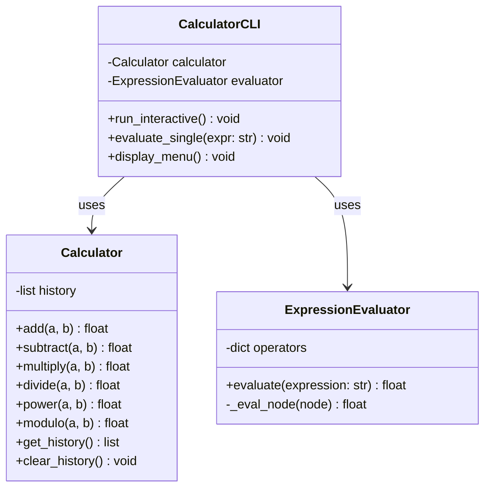
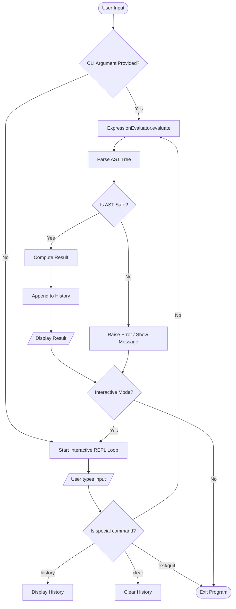

# Simple Calculator (SimCalc) - Design Document

## 1. Overview

SimCalc is a modular, extensible, and safe command-line calculator implemented in Python 3. It supports standard arithmetic operations, parenthesized expressions, computation history, and both interactive (REPL) and one-shot CLI execution modes.

---

## 2. Design Goals & Principles

1. **Safety First**: Avoid dangerous `eval()` execution. Expression parsing is implemented using Python's Abstract Syntax Tree (`ast`) module, strictly allowing only mathematical operators and numeric literals.
2. **Modularity**: Separation of concerns between:
   - Arithmetic operations & state (`Calculator`)
   - Safe expression parsing (`ExpressionEvaluator`)
   - CLI and User Experience (`CalculatorCLI`)
3. **Robust Error Handling**: Graceful recovery from division by zero, invalid characters, unmatched parentheses, and overflow errors.
4. **Zero External Dependencies**: Implemented using standard library modules only (`ast`, `operator`, `sys`, `unittest`, `argparse`).

---

## 3. Architecture & Class Design

---

## 4. Components

### 4.1. Core Calculator (`Calculator`)

Manages fundamental operations and calculation history.

- **Supported Operations**:
  - Addition (`+`)
  - Subtraction (`-`)
  - Multiplication (`*`)
  - Division (`/`)
  - Integer Division (`//`)
  - Modulo (`%`)
  - Exponentiation (`^` or `**`)

### 4.2. Safe Expression Evaluator (`ExpressionEvaluator`)

Parses an infix math expression string into an AST tree and recursively calculates the result:

- **Allowed Nodes**:
  - `ast.Expression`: Top-level container.
  - `ast.BinOp`: Binary operators (`+`, `-`, `*`, `/`, `//`, `%`, `**`).
  - `ast.UnaryOp`: Unary operators (`+`, `-`).
  - `ast.Constant`: Numeric constants (integers, floats).
- **Disallowed**:
  - Function calls (`Call`), attribute access (`Attribute`), variable names (`Name`), imports, etc. Raises `ValueError` if encountered.

### 4.3. Command Line Interface (`CalculatorCLI`)

Provides two operating modes:

1. **One-shot Mode**: `python3 cli.py "12 + 5 * (3 ^ 2)"`
2. **Interactive REPL Mode**: `python3 cli.py` with commands:
   - Input expressions directly (e.g. `(4 + 8) / 2`)
   - `history`: Show calculation history
   - `clear`: Clear history
   - `help`: Display help and examples
   - `exit` or `quit`: Terminate REPL

---

## 5. Flow Diagram

---

## 6. Testing Strategy

- Unit tests written using `unittest`.
- Test suites:
  - Basic arithmetic operations.
  - Precedence and parentheses handling.
  - Floating-point calculations.
  - Error conditions: Division by zero, malformed syntax, injection/disallowed statements.
